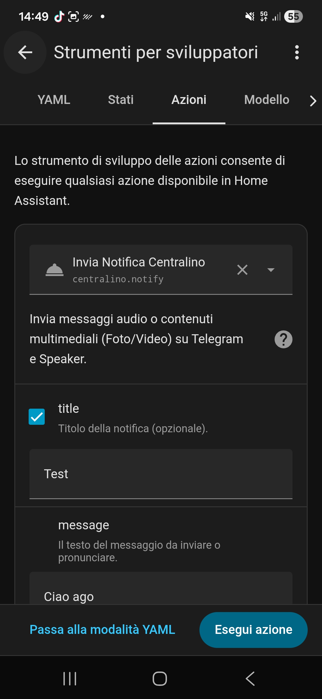
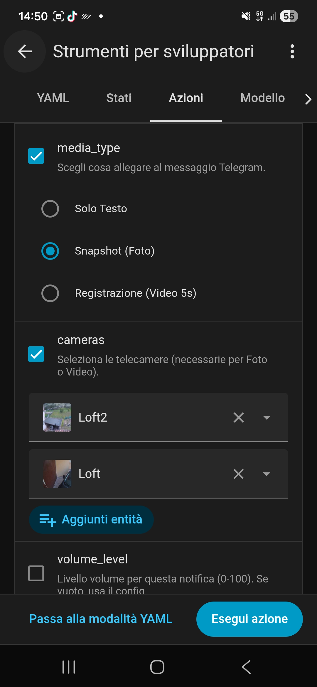
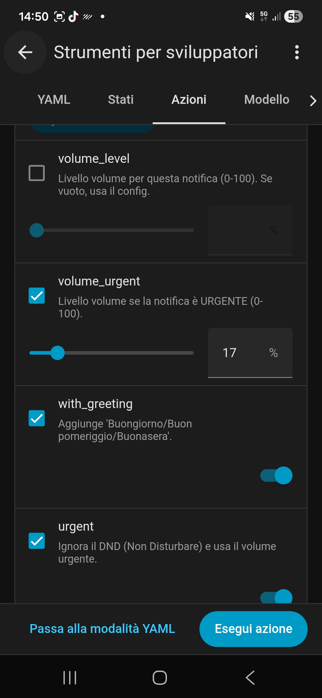

<p align="center">
  
</p>

<h1 align="center">📞 Centralino Manager for Home Assistant</h1>

<p align="center">
  <a href="https://github.com/hacs/integration"></a>
  <a href="https://github.com/ago19800/centralino/releases"></a>
  <a href="https://github.com/ago19800"></a>
  <a href="https://www.home-assistant.io/"></a>
  <a href="LICENSE"></a>
</p>

<p align="center">
  <a href="#-english">🇬🇧 English</a> &nbsp;|&nbsp;
  <a href="#-italiano">🇮🇹 Italiano</a>
</p>

<p align="center">
  
  
  
</p>

<p align="center">
  <a href="https://my.home-assistant.io/redirect/hacs_repository/?owner=ago19800&repository=centralino&category=integration">
    
  </a>
</p>

<p align="center">
  <a href="https://paypal.me/ago19800">
    
  </a>
</p>

---

## 🇬🇧 English

**Centralino Manager** is a custom Home Assistant integration that centralizes and automates smart home notifications. It manages speakers (Alexa, Google Home) and Telegram simultaneously, handling time-based volumes, voice messages, photos and videos from cameras.

### ✨ Features

| Feature | Description |
|---------|-------------|
| 📢 **Multi-device notifications** | Send a message to multiple devices at once using simple names |
| 📷 **Advanced Telegram media** | Send text, photo snapshot or 5-second video from cameras |
| 🕒 **Smart volume control** | Automatically adjusts speaker volume based on time of day |
| 🎚️ **Manual volume override** | Force a specific volume via slider in the service call |
| 🌙 **Do Not Disturb (DND)** | Silences non-urgent notifications during set hours |
| 🎵 **Music restore** | Pauses music, makes announcement, then resumes playback |
| ⏰ **Auto shutdown** | Turns off all media players at a scheduled time |
| 💬 **Auto greeting** | Prepends "Good morning/afternoon/evening" based on the time |

### 🚀 Installation

#### Method 1: HACS (Recommended)

[](https://my.home-assistant.io/redirect/hacs_repository/?owner=ago19800&repository=centralino&category=integration)

Or manually:
1. Make sure [HACS](https://hacs.xyz/) is installed
2. Go to **HACS** → **Integrations**
3. Click the three dots (⋮) → **Custom repositories**
4. Enter URL: `https://github.com/ago19800/centralino` — Category: `Integration`
5. Click **Add** → Search **"Centralino Manager"** → **Download**
6. **Restart Home Assistant**

#### Method 2: Manual

1. Download the latest release from [GitHub Releases](https://github.com/ago19800/centralino/releases)
2. Copy the `centralino` folder to `/config/custom_components/`
3. Final structure:
   ```
   /config/custom_components/centralino/
   ├── __init__.py
   ├── manifest.json
   ├── services.yaml
   └── hacs.json
   ```
4. **Restart Home Assistant**

### ⚙️ Configuration

Add this to your `configuration.yaml`:

```yaml
centralino:
  devices:
    # Alexa speaker
    - id: "1"
      name: "living_room"
      entityId: "media_player.alexa_living_room"
      type: "alexa"
      volumes:
        morning: 40       # Volume 06:00-12:00
        afternoon: 50     # Volume 12:00-20:00
        night: 20         # Volume 20:00-06:00
      enabled: true

    # Google Home speaker
    - id: "2"
      name: "kitchen"
      entityId: "media_player.google_kitchen"
      type: "google"
      volumes:
        morning: 30
        afternoon: 45
        night: 15
      enabled: true

    # Telegram notification
    - id: "3"
      name: "telegram_me"
      chatId: "123456789"   # Your Telegram Chat ID
      type: "telegram"
      enabled: true

  timeDefinitions:
    morningStart: "06:00"
    afternoonStart: "12:00"
    nightStart: "20:00"

  dnd:
    enabled: true
    startTime: "22:30"
    endTime: "07:30"

  shutdownTime: "01:00"
  restoreMusic: true
```

> 💡 **Find your Telegram Chat ID**: Open Telegram, search `@userinfobot`, send `/start`.

### 🛠️ Service Parameters

| Parameter | Type | Required | Description |
|-----------|------|----------|-------------|
| `message` | string | ✅ | Text to send or speak |
| `target` | string/list | ✅ | Device name(s) from config |
| `title` | string | ❌ | Bold title on Telegram |
| `media_type` | select | ❌ | `none`, `snapshot`, `video` |
| `cameras` | list | ❌ | Camera entity IDs |
| `volume_level` | number | ❌ | Force volume 0-100 |
| `volume_urgent` | number | ❌ | Urgent volume (default: 80) |
| `with_greeting` | boolean | ❌ | Add time-based greeting |
| `urgent` | boolean | ❌ | Bypass DND, use urgent volume |

### 📝 Examples

**Simple notification:**
```yaml
service: centralino.notify
data:
  message: "The washing machine has finished"
  target: living_room
```

**Multi-device with greeting:**
```yaml
service: centralino.notify
data:
  title: "Reminder"
  message: "Don't forget to hang the laundry"
  with_greeting: true
  target:
    - living_room
    - kitchen
    - telegram_me
```

**Security alarm with photo:**
```yaml
service: centralino.notify
data:
  title: "ALARM"
  message: "Motion detected at the gate!"
  media_type: "snapshot"
  cameras:
    - camera.entrance
    - camera.garden
  urgent: true
  target:
    - telegram_me
    - living_room
```

**Alarm with video (5 seconds):**
```yaml
service: centralino.notify
data:
  message: "Someone rang the doorbell"
  media_type: "video"
  cameras:
    - camera.doorbell
  target: telegram_me
```

**Full automation example:**
```yaml
automation:
  - alias: "Night motion detection"
    trigger:
      - platform: state
        entity_id: binary_sensor.garden_motion
        to: "on"
    condition:
      - condition: time
        after: "23:00:00"
        before: "06:00:00"
    action:
      - service: centralino.notify
        data:
          title: "SECURITY ALARM"
          message: "Motion detected in the garden!"
          media_type: "video"
          cameras:
            - camera.garden_front
          urgent: true
          target:
            - telegram_me
            - living_room
```

### 📋 Requirements

- **Home Assistant** 2024.1.0+
- **Telegram Bot** configured in `configuration.yaml`:
  ```yaml
  telegram_bot:
    - platform: polling
      api_key: "YOUR_BOT_TOKEN"
      allowed_chat_ids:
        - 123456789
  ```
- **Alexa Media Player** integration (for Alexa devices)
- **Google TTS** or any TTS service (for Google Home)
- Folder `/config/www/` must exist for snapshots/videos

### 🔧 Troubleshooting

| Problem | Solution |
|---------|----------|
| `Action centralino.notify not found` | Check files in `/config/custom_components/centralino/`, add `centralino:` in `configuration.yaml`, restart HA |
| Telegram not receiving | Verify Chat ID with `@userinfobot`, check `telegram_bot` config, verify device `name` in `target:` |
| Speaker not speaking | Check `entityId` in Dev Tools → States, verify TTS service, check DND schedule |
| Volume not changing | Verify `timeDefinitions` hours, check volume values per device |

**Enable debug logs:**
```yaml
logger:
  logs:
    custom_components.centralino: debug
```

---

## 🇮🇹 Italiano

**Centralino Manager** è un'integrazione custom per Home Assistant che centralizza e rende intelligenti le notifiche della tua smart home. Gestisce automaticamente speaker (Alexa, Google Home) e Telegram, occupandosi di volumi orari, messaggi vocali, foto e video dalle telecamere.

### ✨ Funzionalità

| Funzione | Descrizione |
|----------|-------------|
| 📢 **Notifiche multi-dispositivo** | Invia un messaggio a più dispositivi contemporaneamente con nomi semplici |
| 📷 **Media avanzati su Telegram** | Invia testo, foto snapshot o video di 5 secondi dalle telecamere |
| 🕒 **Volumi intelligenti** | Regola automaticamente il volume in base alla fascia oraria |
| 🎚️ **Override volume manuale** | Forza un volume specifico tramite slider nella chiamata al servizio |
| 🌙 **Non Disturbare (DND)** | Silenzia le notifiche non urgenti negli orari configurati |
| 🎵 **Ripristino musica** | Mette in pausa la musica, fa l'annuncio, poi riprende |
| ⏰ **Spegnimento automatico** | Spegne tutti i media player all'orario configurato |
| 💬 **Saluto automatico** | Aggiunge "Buongiorno/Buon pomeriggio/Buonasera" in base all'ora |

### 🚀 Installazione

#### Metodo 1: HACS (Consigliato)

[](https://my.home-assistant.io/redirect/hacs_repository/?owner=ago19800&repository=centralino&category=integration)

Oppure manualmente:
1. Assicurati che [HACS](https://hacs.xyz/) sia installato
2. Vai su **HACS** → **Integrazioni**
3. Clicca sui tre puntini (⋮) → **Repository personalizzati**
4. URL: `https://github.com/ago19800/centralino` — Categoria: `Integration`
5. Clicca **Aggiungi** → Cerca **"Centralino Manager"** → **Scarica**
6. **Riavvia Home Assistant**

#### Metodo 2: Manuale

1. Scarica l'ultima release da [GitHub Releases](https://github.com/ago19800/centralino/releases)
2. Copia la cartella `centralino` in `/config/custom_components/`
3. Struttura finale:
   ```
   /config/custom_components/centralino/
   ├── __init__.py
   ├── manifest.json
   ├── services.yaml
   └── hacs.json
   ```
4. **Riavvia Home Assistant**

### ⚙️ Configurazione

Aggiungi al file `configuration.yaml`:

```yaml
centralino:
  devices:
    # Speaker Alexa
    - id: "1"
      name: "soggiorno"
      entityId: "media_player.alexa_soggiorno"
      type: "alexa"
      volumes:
        morning: 40       # Volume 06:00-12:00
        afternoon: 50     # Volume 12:00-20:00
        night: 20         # Volume 20:00-06:00
      enabled: true

    # Speaker Google Home
    - id: "2"
      name: "cucina"
      entityId: "media_player.google_cucina"
      type: "google"
      volumes:
        morning: 30
        afternoon: 45
        night: 15
      enabled: true

    # Notifiche Telegram
    - id: "3"
      name: "telegram_io"
      chatId: "123456789"   # Il tuo Chat ID Telegram
      type: "telegram"
      enabled: true

  timeDefinitions:
    morningStart: "06:00"
    afternoonStart: "12:00"
    nightStart: "20:00"

  dnd:
    enabled: true
    startTime: "22:30"
    endTime: "07:30"

  shutdownTime: "01:00"
  restoreMusic: true
```

> 💡 **Come trovare il Chat ID Telegram**: Apri Telegram, cerca `@userinfobot`, invia `/start`.

#### Configurazione con più dispositivi

```yaml
centralino:
  devices:
    - id: "1"
      name: "camera"
      entityId: "media_player.echo_dot_camera"
      type: "alexa"
      volumes: { morning: 20, afternoon: 40, night: 10 }
      enabled: true

    - id: "2"
      name: "alexa_cucina"
      entityId: "media_player.echo_show_cucina"
      type: "alexa"
      volumes: { morning: 50, afternoon: 60, night: 25 }
      enabled: true

    - id: "3"
      name: "salotto"
      entityId: "media_player.nest_hub_salotto"
      type: "google"
      volumes: { morning: 45, afternoon: 60, night: 20 }
      enabled: true

    - id: "4"
      name: "telegram_famiglia"
      chatId: "123456789"
      type: "telegram"
      enabled: true

    - id: "5"
      name: "telegram_gruppo"
      chatId: "-987654321"   # ChatId negativo per gruppi
      type: "telegram"
      enabled: true

  timeDefinitions:
    morningStart: "07:00"
    afternoonStart: "13:00"
    nightStart: "21:00"

  dnd:
    enabled: true
    startTime: "23:00"
    endTime: "07:00"

  shutdownTime: "02:00"
  restoreMusic: true
```

### 🛠️ Parametri del Servizio

| Parametro | Tipo | Obbligatorio | Descrizione |
|-----------|------|--------------|-------------|
| `message` | string | ✅ | Testo da inviare o pronunciare |
| `target` | string/list | ✅ | Nome/i dispositivo/i dal config |
| `title` | string | ❌ | Titolo in grassetto su Telegram |
| `media_type` | select | ❌ | `none`, `snapshot`, `video` |
| `cameras` | list | ❌ | Entity ID delle telecamere |
| `volume_level` | number | ❌ | Volume forzato 0-100 |
| `volume_urgent` | number | ❌ | Volume urgente (default: 80) |
| `with_greeting` | boolean | ❌ | Aggiunge saluto automatico |
| `urgent` | boolean | ❌ | Ignora DND, usa volume urgente |

### 📝 Esempi Pratici

**Notifica semplice:**
```yaml
service: centralino.notify
data:
  message: "La lavatrice ha finito"
  target: soggiorno
```

**Multi-dispositivo con saluto:**
```yaml
service: centralino.notify
data:
  title: "Promemoria"
  message: "Ricordati di stendere i panni"
  with_greeting: true
  target:
    - soggiorno
    - cucina
    - telegram_io
```

**Allarme sicurezza con foto:**
```yaml
service: centralino.notify
data:
  title: "ALLARME"
  message: "Movimento rilevato al cancello!"
  media_type: "snapshot"
  cameras:
    - camera.ingresso
    - camera.giardino
  urgent: true
  target:
    - telegram_famiglia
    - soggiorno
```

**Notifica con video (5 secondi):**
```yaml
service: centralino.notify
data:
  message: "Qualcuno ha suonato al campanello"
  media_type: "video"
  cameras:
    - camera.citofono
  target: telegram_io
```

**Automazione completa:**
```yaml
automation:
  - alias: "Movimento rilevato di notte"
    trigger:
      - platform: state
        entity_id: binary_sensor.sensore_movimento_giardino
        to: "on"
    condition:
      - condition: time
        after: "23:00:00"
        before: "06:00:00"
    action:
      - service: centralino.notify
        data:
          title: "ALLARME SICUREZZA"
          message: "Rilevato movimento in giardino!"
          media_type: "video"
          cameras:
            - camera.giardino_anteriore
          urgent: true
          target:
            - telegram_famiglia
            - camera
```

### 📋 Requisiti

- **Home Assistant** 2024.1.0+
- **Telegram Bot** in `configuration.yaml`:
  ```yaml
  telegram_bot:
    - platform: polling
      api_key: "TUO_BOT_TOKEN"
      allowed_chat_ids:
        - 123456789
  ```
- Integrazione **Alexa Media Player** (per Alexa)
- **Google TTS** o altro servizio TTS (per Google Home)
- Cartella `/config/www/` deve esistere per snapshot/video

### 🔧 Risoluzione Problemi

| Problema | Soluzione |
|----------|-----------|
| `Action centralino.notify not found` | Verifica i file in `/config/custom_components/centralino/`, aggiungi `centralino:` in `configuration.yaml`, riavvia HA |
| Telegram non riceve messaggi | Verifica Chat ID con `@userinfobot`, controlla `telegram_bot`, verifica il `name` in `target:` |
| Speaker non parla | Controlla `entityId` in Strumenti → Stati, verifica TTS, controlla orari DND |
| Volume non cambia | Verifica `timeDefinitions`, controlla valori volume per fascia |

**Abilita log di debug:**
```yaml
logger:
  logs:
    custom_components.centralino: debug
```

### 🤝 Contribuire

Segnalazioni bug e richieste di funzionalità benvenute! Apri una [Issue](https://github.com/ago19800/centralino/issues) con versione HA, log e configurazione (senza dati sensibili).

---

## 📄 License / Licenza

MIT — see [LICENSE](LICENSE) for details.

---

## ☕ Support / Supporta il Progetto

<p align="center">
  <strong>Se questo progetto ti è utile / If this project is useful to you:</strong><br><br>
  ⭐ Star on GitHub &nbsp;|&nbsp; 🐛 Report bugs &nbsp;|&nbsp; ☕ <a href="https://paypal.me/ago19800">Buy me a coffee</a>
  <br><br>
  <a href="https://paypal.me/ago19800">
    
  </a>
</p>

---

## 📞 Support / Supporto

- **Issues**: [GitHub Issues](https://github.com/ago19800/centralino/issues)
- **Discussions**: [GitHub Discussions](https://github.com/ago19800/centralino/discussions)
- **Community IT**: [Forum Home Assistant Italia](https://forum.hassiohelp.eu/)

---

<p align="center">
  Developed by <a href="https://github.com/ago19800"><strong>@ago1980</strong></a> — v2.4.0
</p>
